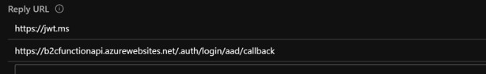

# Protecting an Azure Function using AAD B2C
 
Protecting an Azure Function App using the [Azure AD B2C](https://docs.microsoft.com/en-us/azure/active-directory-b2c) authentication provider is very similar to protecting it using Azure AD (as documented [here](https://docs.microsoft.com/en-us/azure/app-service/configure-authentication-provider-aad)) with just a couple of minor differences.  In this article, we'll walk through the steps to protect an [Azure Function](https://docs.microsoft.com/en-us/azure/azure-functions/functions-overview) using Azure AD B2C and highlight those differences.
 
## Create a Function App
Let's start by creating an Azure Function to protect using the Azure portal. In your portal, create a new *Resource* of type *Function App*.  Then click *Go to resource* and create a http triggered aka *Webhook + API function*.   Far better documentation can be found [here](https://docs.microsoft.com/en-us/azure/azure-functions/functions-create-first-azure-function).
 
To test our system generated http triggered function, we turn to the trusty [Postman](https://www.postman.com) tool.  

Copy the function url found by clicking the *</>Get function URL* link in the upper left of the function's blade.

 
In Postman paste the function url, click the *Params* tab and enter a new *key* called **name** with a *value*, e.g. "World".  Click *Send* and see that the function successfully returns *Hello, World* with a status of *200 OK*.

As expected, the function runs without any authentication.  Now, let's lock this function down so only our AAD B2C tenant can access it.
 
## Configure the AAD B2C App
We've assumed an AAD B2C tenant has already been set up, but if not, documentation can be found [here](https://docs.microsoft.com/en-us/azure/active-directory-b2c/tutorial-create-tenant).  Also a *Sign-up/Sign-in* B2C policy has been created, documentation [here](https://docs.microsoft.com/en-us/azure/active-directory-b2c/tutorial-create-user-flows#create-a-sign-up-and-sign-in-user-flow).
 
In your B2C tenant, create a new B2C app and set *Include web app / web API* and *Allow implicit flow* to **Yes**.

In the *Reply URL* field, enter a value with the following format: 

`[Your Function App URL]/.auth/login/add/callback`.
 
The Url of your Function App can be found in its *Overview* tab.  Important!, make sure to  enter the Url with https!  

This tells the AAD B2C app to send the authorization tokens to our Function App upon successful authentication.  
 
Now that we've wired our B2C App to talk to our Function App, next is to make sure our Function App is connected to our B2C App.
 
## Configure the Function App
In your Function App, go to function's *Platform Features* tab and select *Authentication / Authorization* under *Networking*.

Switch the *App Service Authentication* to **On** and notice a whole slew of new options are presented.  Next change the *Action to take when request is not authenticated* to **Login with Active Directory**.

Next click on the *Azure Active Directory (Not Configured)* which launches the *Azure Active Directory Settings* blade.

*But I thought we were supposed to use AAD B2C* you say, well by specifying the B2C's Sign-up/Sign-up policy as part of this configuration, we're making sure unauthenticated requests are directed to our AAD B2C tenant.
 
Click on *Advanced* under the *Management Mode* and proceed to enter the *Client ID* and *Issuer URl*.
 
This is where the differences I mentioned at the beginning of this article take place.  Instead of entering a *Client ID* and *Issuer URL* associated to Azure AD, we'll enter those associated to AAD B2C.  
 
The *Client ID* field is the AAD B2C Application ID of your B2C App.  Go to your B2C app's *Properties* blade.

The *Issuer URL* field is your Sign-up/Sign-in B2C policy.  Go to *User Flows*, select your Sign-up/Sign-in policy, click *Run user flow* and copy the url located at the top of the *Run user flow* blade.

Complete the *Client ID* and *Issuer URL* fields, click *OK* and *Save*.  
 
Congratulations your Function App is now protected with AAD B2C!  
 
Run the same Postman test again and notice this time a status of *401 Unauthorized* is returned.  
 
That's pretty awesome right?, but how do we call the protected function successfully?, well we'll need an auth token *Of course*!  To do this, let's go back to B2C App in its *Properties* blade and enter a new *Reply URL* with a value of *https://jwt.ms*.

Now go to the *User flows*, select your Sign-up/Sign-in flow, click *Run user flow*, select your B2C App and *https://jwt.ms* as the *Reply URL* and click the *Run user flow* button.

A browser window opens with the jwt.ms site capturing the generated token.  
 
Next copy the token from jwt.ms and go to Postman, click on its *Authorization* tab, and choose **Bearer Token** in the *Type* field.

Paste the token in the *Token* field and click Send and notice the function returns successfully. 
